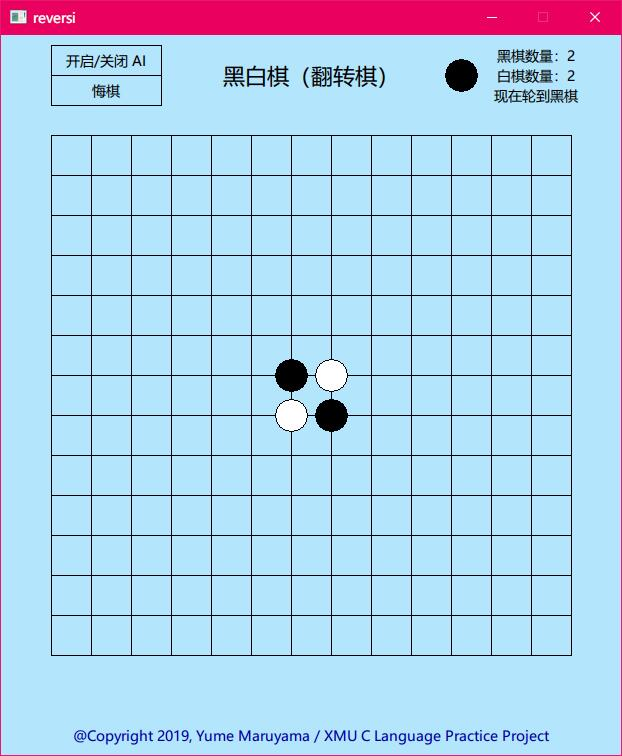

# 黑白棋课程设计 Reversi

2019 厦门大学 C 语言实践课程设计项目。个简单的黑白棋小游戏，基于 Visual Studio 2017 构建，采用 EasyX 绘图库，使用了部分 C++ 特性，故只能在 Windows 下运行。

游戏支持 PVE （电脑 AI 采用的是引入了随机化的贪心策略）和 PVP，支持悔棋等操作。

可执行文件位于 Release 目录中，源代码位于 reversi 目录中。

项目完成时间较仓促，因此难免存在一些问题，若您发现了任何影响体验的问题，请联系我：kirainmoe@gmail.com.

# 提示

1. 编译环境为 Windows 10，使用了较高版本的 Visual Studio，因此可能需要 Windows 7+ 的系统才可以运行，并且需要安装 VS2017 运行库。

2. 生成项目的时候需要在项目选项中，将“字符集”从“使用 Unicode 字符集”设置为“使用多字节字符集”以避免 EasyX 绘制文字时乱码。

# 截图

# License

MIT License